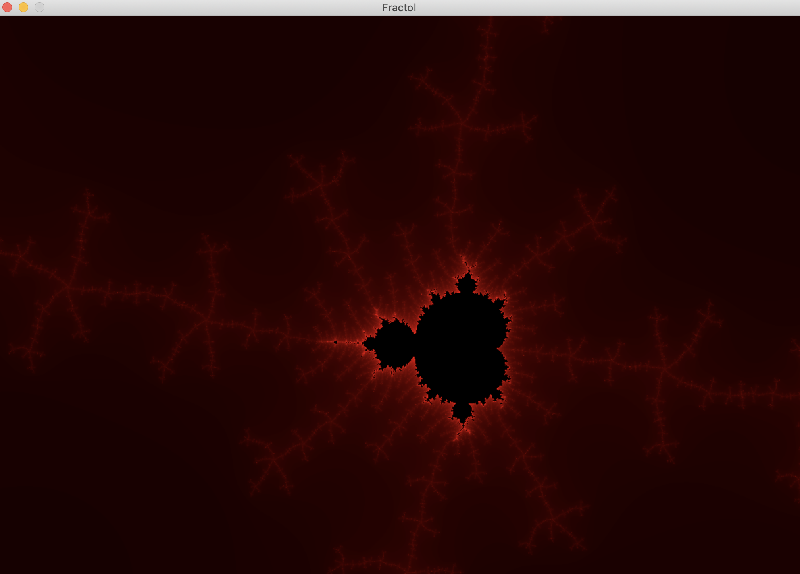

# Fract_ol
 [](https://github.com/Kirnata/Fract_ol.git)<br>
Fract`ol is one of the first computer graphics projects in the 42 core curriculum, where you work with the miniLibx-Library. The project is meant to create graphically beautiful fractals. <br>

## Cloning <br>
```
git clone https://github.com/Kirnata/Fract_ol.git
cd Fract_ol
make
```

## Make commands
- `make` to compile mandatory part. <br>
- `make clean` to clean all object files of libft. <br>
- `make fclean` to remove executable files. <br>
- `make re` to recompile this project.<br>

## Features
Multiple fractals : Mandelbrot, Julia, BurningShip. Increase and decrease max iteration for shape calculation. Zoom and unzoom. Different colors patterns.

## How to use?
 ```
$> ./fractol mandelbrot
$> ./fractol julia
$> ./fractol burningship
 ```
 ## Сontrol buttons

- `space` to change colors. <br>
- `+ -` to increase and decrease max iteration. <br>
- `↑ , ↓ , ← , → ` changes the position of the fractal in the window. <br>
- `mouse scroll` to zoom follows the actual mouse position. <br>

## Pictures



 ## Subject
 > [subject](subject.pdf)
